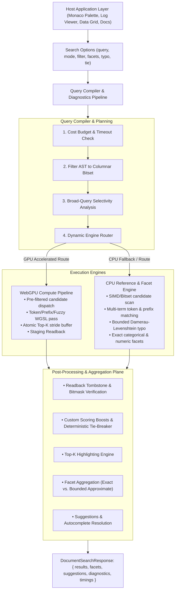

# Issue #10 — v0.4 Extensible Local-Search Features for Host Applications: Implementation Plan

> **Issue Reference**: [GitHub Issue #10: v0.4: add extensible local-search features for host applications](https://github.com/codewarnab/webgpu-fuzzy-search/issues/10)  
> **Target Milestone**: `0.4.0`  
> **Status**: Approved Architectural Plan / Ready for Execution  
> **Predecessor**: v0.3.0 (Embeddable Document, Mutation, Worker, Highlight, and Persistence APIs)  

---

## 0. Executive Summary & Outcome

The objective of v0.4 is to equip `webgpu-search` with the comprehensive, extensible local-search capabilities required by modern host applications—such as browser IDEs (Monaco symbol navigation, file pickers), data grids, streaming log viewers, offline documentation portals, and local-first personal apps—while preserving the engine's core identity: **100% private, offline-capable, framework-neutral, and zero-dependency**.

Host applications will gain:
1. **Structured Filters**: Expressive predicate trees (`eq`, `in`, `range`, `and`/`or`/`not`, `exists`) evaluated via high-speed columnar bitsets that narrow candidates before or during scoring.
2. **Facet Aggregations**: Exact and approximate categorical and numeric bucket distributions with explicit overflow semantics.
3. **Expanded Search Modes**: Native support for `'token'` (multi-term AND/OR matching), `'prefix'` (instant symbol/trie search), `'substring'`, and `'fuzzy'` with versioned integer scoring.
4. **Bounded Typo-Tolerance & Deterministic Ranking**: Damerau-Levenshtein distance bounds with length locks and deterministic multi-tier tie-breaking (`score DESC`, `weight DESC`, `exact DESC`, `length ASC`, `id ASC`).
5. **Autocomplete & Suggestion Primitives**: Framework-agnostic completion, term expansion, and "did-you-mean" primitives.
6. **Extensibility Pipeline**: Type-safe extension hooks for custom tokenization (e.g. code symbols `_`, `-`, `camelCase`), field-based scoring boosts, and result post-processing.
7. **Cost Budgets & Diagnostics**: Query execution deadlines, memory guards, candidate overflow diagnostics, and broad-query CPU/GPU auto-routing.

---

## 1. Architectural Principles & Invariants

### 1.1 Non-Negotiable Acceptance Boundaries

1. **Scoring & Ordering Parity**: WebGPU compute passes and CPU reference algorithms must either produce identical ordered result contracts or explicitly route unsupported features (e.g. non-linear custom scoring hooks or unindexed dynamic filters) to the CPU reference engine with a recorded `fallbackReason`.
2. **Fail-Closed Persistence (U2D4)**: Columnar filter metadata, attribute schemas, and facet indexes serialize into the Little-Endian binary format with magic `0x55324434` (`U2D4`). Header CRC32 covers `[0..52)` plus all payload segments. Any version, profile, or checksum mismatch throws `IncompatibleIndexError`.
3. **Safe Extensibility**: Extension hooks (tokenizers, custom rankers, filter predicates) cannot silently invalidate index schemas or persistence formats. Custom scoring hooks that depend on arbitrary JavaScript closures are executed post-match and flagged if snapshot restore lacks their definitions.
4. **Deterministic Tie-Breaking**: When multiple records achieve identical match scores, ordering is strictly deterministic across all browsers, workers, and engines, governed by explicit tie-breaker hierarchies.
5. **Zero Framework Coupling & Zero Core Runtime Dependencies**: The core package `packages/webgpu-search` maintains zero external runtime dependencies. All DOM calls are strictly guarded for Web Worker and Node.js/SSR environments.

### 1.2 Non-Goals

- No natural-language semantic search, embedding models, or vector ANN search.
- No remote crawling, scraping, or server-side ingestion pipelines.
- No hosted search cloud infrastructure or analytics telemetry backends.
- No full Unicode locale-aware collation or linguistic stemming libraries (e.g. Porter/Snowball).

---

## 2. Target Architecture & Data Flow



```
┌────────────────────────────────────────────────────────────────────────────────────────┐
│ Host Application Layer (Monaco Palette, Log Viewer, Data Grid, Offline Docs)           │
├────────────────────────────────────────────────────────────────────────────────────────┤
│ Search Options: { query, mode: 'token'|'prefix'|'fuzzy', filter, facets, typo, tie }   │
└───────────────────────────────────────────┬────────────────────────────────────────────┘
                                            │
                                            ▼
┌────────────────────────────────────────────────────────────────────────────────────────┐
│ Query Compiler & Diagnostics Pipeline                                                  │
├────────────────────────────────────────────────────────────────────────────────────────┤
│ 1. Cost Budget & Timeout Check (maxExecutionTimeMs, candidateThreshold)               │
│ 2. Filter Compiler: AST ──> Columnar Bitset Evaluation (DocumentBitset)               │
│ 3. Broad-Query Detection: (Query Selectivity vs. GPU Capacity Analysis)                │
│ 4. Engine Router: WebGPU Dispatch vs. CPU Reference Route                              │
└─────────────────────┬──────────────────────────────────────────┬───────────────────────┘
                      │                                          │
       [GPU Accelerated Route]                    [CPU Route / Fallback]
                      ▼                                          ▼
┌────────────────────────────────────────┐     ┌─────────────────────────────────────────┐
│ WebGPU Compute Pipeline                │     │ CPU Reference & Facet Engine            │
├────────────────────────────────────────┤     ├─────────────────────────────────────────┤
│ • Pre-Filtered Candidate Dispatch      │     │ • SIMD / Bitset Candidate Iteration     │
│ • Token / Prefix / Fuzzy WGSL Pass     │     │ • Multi-Term Token / Prefix Matching    │
│ • Atomic Candidate Top-K Stride Buffer │     │ • Bounded Typo Distance (Damerau-Lev)   │
│ • Direct Staging Readback              │     │ • Exact Categorical & Numeric Facets    │
└─────────────────────┬──────────────────┘     └─────────────────────────┬───────────────┘
                      │                                                  │
                      └─────────────────────┬────────────────────────────┘
                                            │
                                            ▼
┌────────────────────────────────────────────────────────────────────────────────────────┐
│ Post-Processing & Aggregation Plane                                                    │
├────────────────────────────────────────────────────────────────────────────────────────┤
│ • Readback Tombstone & Filter Bitmask Verification                                     │
│ • Custom Scoring Boosts (ScoringHook) & Deterministic Tie-Breaker Sort                 │
│ • Top-K Highlighting Engine (leadingTrimOffset & Atomic Character Expansion)          │
│ • Facet Aggregation (Exact vs. Bounded Approximate on Overflow)                       │
│ • Suggestions / Did-You-Mean Primitive Resolution                                      │
└───────────────────────────────────────────┬────────────────────────────────────────────┘
                                            │
                                            ▼
┌────────────────────────────────────────────────────────────────────────────────────────┐
│ DocumentSearchResponse<TDoc>: { results, facets, suggestions, diagnostics, timings }   │
└────────────────────────────────────────────────────────────────────────────────────────┘
```

---

## 3. Detailed Component Specifications

### 3.1 Structured Filters & Columnar Metadata

#### Filter Expression AST
```typescript
export type FilterValue = string | number | boolean;

export interface FieldComparison {
  eq?: FilterValue;
  neq?: FilterValue;
  gt?: number | string;
  gte?: number | string;
  lt?: number | string;
  lte?: number | string;
  in?: FilterValue[];
  nin?: FilterValue[];
  exists?: boolean;
}

export type FieldFilter = {
  [field: string]: FilterValue | FilterValue[] | FieldComparison;
};

export type FilterExpression =
  | FieldFilter
  | { and: FilterExpression[] }
  | { or: FilterExpression[] }
  | { not: FilterExpression };
```

#### Columnar Attribute Storage
Attributes configured for filtering (`filterFields` in index options) are indexed in contiguous typed arrays:
- **Categorical / Low-Cardinality Strings**: Dictionary-encoded uint16/uint32 keys pointing to unique string tables.
- **Numeric Fields (integers, floats, timestamps)**: `Float64Array` or `Int32Array` columns.
- **Tag Sets (string arrays)**: Inverted bitsets or packed postings arrays.
- **Evaluation**: Filter expressions compile into a `DocumentBitset` (a wrapper over `Uint32Array`), enabling $O(N / 32)$ bitwise evaluation.

### 3.2 Facet Counts with Exact vs. Approximate Semantics

#### Facet Request & Result Contracts
```typescript
export interface TermsFacetRequest {
  type: 'terms';
  field: string;
  limit?: number; // default: 10
  sortBy?: 'count' | 'value';
}

export interface RangeFacetBucket {
  from?: number;
  to?: number;
  key?: string;
}

export interface RangeFacetRequest {
  type: 'range';
  field: string;
  ranges: RangeFacetBucket[];
}

export type FacetRequest = TermsFacetRequest | RangeFacetRequest;

export interface TermsFacetResult {
  type: 'terms';
  field: string;
  isApproximate: boolean;
  buckets: Array<{ value: string | number; count: number }>;
}

export interface RangeFacetResult {
  type: 'range';
  field: string;
  isApproximate: boolean;
  buckets: Array<{ key: string; from?: number; to?: number; count: number }>;
}

export type FacetResult = TermsFacetResult | RangeFacetResult;
```

#### Exact vs Approximate Boundary
- **Exact Semantics**: When executing on CPU, or when GPU candidate count is within buffer capacity (`hasOverflow: false`), all matching document indices are scanned to produce exact facet counts.
- **Approximate Semantics**: When WebGPU search hits `hasOverflow: true` (candidates exceed `candidateCapacity`), the facet engine calculates distributions over the top candidate pool and marks `isApproximate: true`. Host applications requiring exact facets across massive datasets can specify `faceting: 'force-exact'`, causing automatic CPU candidate evaluation.

### 3.3 Expanded Search Modes & Typo Tolerance

1. **`'fuzzy'`**: Subsequence matching with word-boundary bonuses, consecutive run bonuses, span penalty, and length penalty.
2. **`'substring'`**: Contiguous slice matching with exact-case bonuses and offset penalties.
3. **`'prefix'`**: Prefix-anchored matching on document tokens. Ideal for Monaco code completions and symbol navigation.
4. **`'token'`**: Multi-word query parsing (splits on whitespace/punctuation); requires all tokens (`operator: 'and'`) or any token (`operator: 'or'`) with proximity scoring.

#### Typo Tolerance Options
```typescript
export interface TypoToleranceOptions {
  enabled?: boolean;                // Default: false
  maxDistance?: 1 | 2;              // Default: 1
  minWordLengthForOneTypo?: number; // Default: 4
  minWordLengthForTwoTypos?: number;// Default: 8
  prefixExactLength?: number;       // Default: 1 (first N chars must match exactly)
}
```

### 3.4 Deterministic Ranking & Tie-Breaking

When match scores are tied, ordering must remain 100% deterministic across all environments:
1. `score DESC`: Primary match score.
2. `fieldWeight DESC`: Matches in higher-weighted fields take precedence.
3. `isExactMatch DESC`: Full string or exact token equality precedes partial/fuzzy matches.
4. `length ASC`: Shorter matched field lengths precede longer strings.
5. `id ASC`: Stable string/numeric document ID breaks remaining ties.

### 3.5 Suggestions & Autocomplete Primitives

```typescript
export interface SuggestOptions {
  limit?: number;                   // Default: 5
  mode?: 'prefix' | 'fuzzy';        // Default: 'prefix'
  fuzzyDistance?: number;           // Default: 0 (or 1 for typo-tolerant suggest)
  field?: string;                   // Restrict to specific field
}

export interface SuggestionItem<TDoc = any> {
  text: string;
  score: number;
  type: 'completion' | 'did-you-mean';
  matchedRanges: HighlightRange[];
  docId?: DocumentId;
  doc?: TDoc;
}
```

### 3.6 Extension Pipeline

```typescript
export interface SearchExtensionHooks<TDoc = any> {
  tokenizer?: (text: string) => string[];
  scoringHook?: (doc: TDoc, baseScore: number, matchInfo: MatchInfo) => number;
  filterPredicate?: (doc: TDoc) => boolean;
  postProcess?: (results: DocumentSearchResultItem<TDoc>[]) => DocumentSearchResultItem<TDoc>[];
}
```

### 3.7 Cost Budgets & Query Diagnostics

#### Cost Budget Options & Diagnostics Contracts
```typescript
export interface CostBudgetOptions {
  maxExecutionTimeMs?: number;      // Maximum execution wall-clock time in milliseconds
  maxCandidates?: number;           // Ceiling on candidates scored
  abortSignal?: AbortSignal;        // Caller abort signal
}

export interface QueryDiagnostics {
  scannedCandidates: number;        // Total candidate rows evaluated
  filterSelectivity: number;        // Ratio of candidates matching filter (0.0 - 1.0)
  routedEngine: 'webgpu' | 'cpu';   // Engine that processed the query
  hasOverflow: boolean;             // Whether GPU candidate capacity was exceeded
  timings: {
    filteringMs: number;            // Time spent evaluating columnar bitsets
    scoringMs: number;              // Time spent in compute kernel or CPU reference
    highlightMs: number;            // Time spent extracting Unicode highlight ranges
    facetingMs?: number;            // Time spent aggregating facet buckets
    totalMs: number;                // End-to-end query latency
  };
  warnings?: string[];              // Non-fatal advisory notices (e.g. broad-query fallback)
}
```

#### Broad-Query Safeguards
- Queries with low selectivity (matching $> 80\%$ of dataset on large collections) dynamically adjust candidate dispatch or route to streaming CPU execution to prevent GPU driver timeouts (TDR).
- Execution budgets enforce strict deadlines; exceeding `maxExecutionTimeMs` triggers clean fail-closed abort with `CostBudgetExceededError`.

### 3.8 Versioned Binary Persistence (U2D4)

#### Header Specification & Layout (56 Bytes, Little-Endian)
- `magic`: `0x55324434` (`'U2D4'` in ASCII, offset `0x00`)
- `formatVersion`: `4` (offset `0x04`)
- `profileId`: `0x0001` (`'unicode-default'`, offset `0x08`)
- `unicodeVersion`: `0x00100000` (16.0.0 packed, offset `0x0C`)
- `scoringVersion`: `0x00040000` (`'v0.4.0'`, offset `0x10`)
- `docCount`: `u32` (offset `0x14`)
- `rowCount`: `u32` (offset `0x18`)
- `tokenCount`: `u32` (offset `0x1C`)
- `folded`: `u32` (0 or 1, case-folding mode flag, offset `0x20`)
- `schemaByteLength`: `u32` (offset `0x24`)
- `docsByteLength`: `u32` (0 for decoupled storage, offset `0x28`)
- `columnarByteLength`: `u32` (serialized columnar attribute buffers and string dictionary, offset `0x2C`)
- `reserved`: `u32` (zero-padded for future extensions, offset `0x30`)
- `checksum`: `u32` (CRC32 over header bytes `0..52` followed by all payload segments, offset `0x34`)

> **8-Byte Alignment**: 56 bytes is evenly divisible by 8 (`56 % 8 === 0`), guaranteeing that subsequent 64-bit columnar typed arrays (`Float64Array`) and dictionary buffers in the payload remain aligned without requiring manual padding.

#### Serialization & Restoration Invariants
1. **Zero-Tombstone Precondition**: Serializing an index automatically flushes tombstones via compaction, ensuring optimal binary size.
2. **Fail-Closed Validation**: Header magic, format version, profile ID, and CRC32 checksum are verified before decoding payload segments. Tampered snapshots throw `CorruptedIndexError`.
3. **Safe Extension Restore**: Snapshots referencing custom `scoringHook` or `tokenizer` IDs require registered hooks at restore time; missing hooks throw `IncompatibleHookError`.

---

## 4. Implementation Milestones & Work Breakdown

```
M1: Specifications, Filter AST, Search Modes & U2D4 Header
 ├── Comprehensive types in types.ts
 ├── Filter AST & Columnar attribute schemas
 └── U2D4 binary specification & magic constant
      │
      ▼
M2: Columnar Attribute Index & Structured Pre-Filtering
 ├── High-speed DocumentBitset (Uint32Array bitwise operators)
 ├── Inverted category dictionary & numeric column arrays
 └── Filter compiler & mutation lifecycle integration
      │
      ▼
M3: Facet Aggregation Engine
 ├── Terms & Range facet evaluators
 ├── Exact vs Approximate semantics & isApproximate indicator
 └── Conjunction / disjunctive multi-facet navigation
      │
      ▼
M4: Token & Prefix Search Modes with Bounded Typo-Tolerance
 ├── Multi-term 'token' search engine (AND/OR with proximity)
 ├── High-speed 'prefix' search mode for symbol navigation
 └── Damerau-Levenshtein typo tolerance with length gates
      │
      ▼
M5: Deterministic Ranking & Autocomplete Primitives
 ├── Multi-tier deterministic tie-breaking (score, weight, exact, len, id)
 ├── First-party suggest() API for term completions & did-you-mean
 └── Framework-neutral suggestion result contract
      │
      ▼
M6: Extensibility Pipeline & Safe Hook Architecture
 ├── TokenizerHook (camelCase, snake_case, code symbols)
 ├── ScoringHook (recency, popularity, dynamic boosts)
 └── IncompatibleHookError & safe persistence guards
      │
      ▼
M7: Query Diagnostics, Cost Budgets & Broad-Query Safeguards
 ├── Cost budgets (maxExecutionTimeMs, candidate limits)
 ├── Detailed QueryDiagnostics telemetry & timing breakdown
 └── Broad-query detection with GPU saturation protection
      │
      ▼
M8: U2D4 Snapshot Persistence, Proof Apps & Benchmarks
 ├── Versioned U2D4 serialization & IndexedDB restore
 ├── apps/monaco-palette (symbol prefix + type filter + autocomplete)
 ├── apps/log-viewer (log level filter + timestamp range + facet counts)
 └── Comprehensive benchmark matrix & verification subagent sign-off
```

---

### Milestone 1: Specifications, Filter AST, Search Modes & U2D4 Header

- **Objective**: Establish the public contracts, AST schemas, search mode definitions, and binary serialization headers for v0.4.
- **Target Files**:
  - `packages/webgpu-search/src/types.ts`
  - `packages/webgpu-search/src/text-profile.ts`
  - `packages/webgpu-search/src/errors.ts`
- **Data Structures & API Contracts**:
  - Extend `SearchMode`: `'fuzzy' | 'substring' | 'token' | 'prefix'`.
  - Define `FilterExpression`, `FieldComparison`, `FilterValue`.
  - Define `FacetRequest`, `FacetResult`, `TermsFacetResult`, `RangeFacetResult`.
  - Define `TypoToleranceOptions`, `DeterministicRankingOptions`, `CostBudgetOptions`.
  - Define `SuggestionItem`, `SuggestOptions`, `SuggestResponse`.
  - Define `SearchExtensionHooks<TDoc>`.
  - Introduce `FORMAT_VERSION = 4`, `U2D4_MAGIC = 0x55324434` ('U2D4').
  - Define `IncompatibleHookError`, `CostBudgetExceededError`, `InvalidFilterError`.
- **Implementation Specifications & Invariants**:
  - Backward compatibility invariant: existing search modes and options remain fully functional without behavioral breakage.
  - Zero-dependency invariant: all new interfaces and types compile strictly with zero runtime dependencies.
  - Portability invariant: zero unguarded DOM references (`window`, `document`) across all type and error declarations.
  - Header version invariant: format version bumped to 4 (`U2D4`) with forward-incompatible guard.
- **Quality Gates**:
  - `bun run typecheck` passes across entire monorepo.
  - Zero runtime dependency additions.
- **Definition of Done (DoD)**:
  - All public types and interfaces for v0.4 compile with complete documentation comments.

---

### Milestone 2: Columnar Attribute Index & Structured Pre-Filtering

- **Objective**: Implement the columnar data plane and high-speed bitset evaluator to narrow candidates before or during scoring.
- **Target Files**:
  - `packages/webgpu-search/src/filter/bitset.ts` (new)
  - `packages/webgpu-search/src/filter/columnar-store.ts` (new)
  - `packages/webgpu-search/src/filter/filter-evaluator.ts` (new)
  - `packages/webgpu-search/src/document-index.ts`
- **Data Structures & API Contracts**:
  - `DocumentBitset`: Class managing a `Uint32Array` buffer with operations `set(docId)`, `clear(docId)`, `has(docId)`, `and(other)`, `or(other)`, `andNot(other)`, `popcount()`, `getMatchingIndices()`.
  - `ColumnarStore`: Manages numeric arrays (`Float64Array`), categorical string dictionary tables (`Uint16Array` + string pools), and tag set postings.
  - `compileFilter(expression: FilterExpression, store: ColumnarStore): DocumentBitset`.
- **Implementation Specifications & Invariants**:
  - Incremental sync invariant: mutations (`add()`, `update()`, `remove()`) atomically update columnar structures and clear tombstones.
  - Performance invariant: Filter evaluation resolves in $< 50\,\mu\text{s}$ per 10k rows on CPU.
  - Pre-filter invariant: Inactive candidates bitmasked to 0 are never passed to the scoring kernel or are rejected during readback.
  - Memory invariant: Columnar storage pre-allocates contiguous typed buffers with geometric growth.
- **Quality Gates**:
  - `bun test test/filter.test.ts` (equality, numeric range, in, not, and, or combinators).
  - `bun run typecheck` & `bun run build`.
- **Definition of Done (DoD)**:
  - Structured filters filter candidates prior to scoring; incremental updates maintain bitset accuracy.

---

### Milestone 3: Facet Aggregation Engine

- **Objective**: Implement categorical terms and numeric range facet calculations with clear exact vs. approximate semantics.
- **Target Files**:
  - `packages/webgpu-search/src/facets/facet-engine.ts` (new)
  - `packages/webgpu-search/src/document-index.ts`
  - `packages/webgpu-search/src/types.ts`
- **Data Structures & API Contracts**:
  - `FacetEngine`: Aggregates bucket counts across active filtered candidates.
  - `TermsFacetResult`: `{ type: 'terms', field, isApproximate, buckets: Array<{ value, count }> }`.
  - `RangeFacetResult`: `{ type: 'range', field, isApproximate, buckets: Array<{ key, from?, to?, count }> }`.
  - Disjunctive faceting support via filter exclusion masks.
- **Implementation Specifications & Invariants**:
  - Transparent precision invariant: Facet distributions report `isApproximate: false` when full candidate evaluation is performed. If GPU overflow occurs (`hasOverflow: true`), results must flag `isApproximate: true`.
  - Fallback invariant: Optional `faceting: 'force-exact'` forces CPU evaluation to guarantee zero approximation.
  - Boundary invariant: Range facets operate on half-open intervals `[from, to)`.
  - Latency invariant: $< 2\,\text{ms}$ aggregation time for 50k documents.
- **Quality Gates**:
  - `bun test test/facets.test.ts`
  - Benchmarked against 50k items: facet aggregation completes in $< 2\,\text{ms}$.
- **Definition of Done (DoD)**:
  - Facet requests return typed buckets with exact/approximate status clearly flagged.

---

### Milestone 4: Token & Prefix Search Modes with Bounded Typo-Tolerance

- **Objective**: Implement `'token'` multi-word matching, `'prefix'` symbol search, and bounded Damerau-Levenshtein typo tolerance.
- **Target Files**:
  - `packages/webgpu-search/src/cpu-reference.ts`
  - `packages/webgpu-search/src/modes/token-search.ts` (new)
  - `packages/webgpu-search/src/modes/prefix-search.ts` (new)
  - `packages/webgpu-search/src/modes/typo-distance.ts` (new)
  - `packages/webgpu-search/src/webgpu-engine.ts`
- **Data Structures & API Contracts**:
  - `TokenMatchOptions`: `{ operator?: 'and' | 'or', minMatchCount?: number }`.
  - `PrefixSearchOptions`: `{ prefixLength?: number, exactCase?: boolean }`.
  - `TypoToleranceOptions`: `{ enabled, maxDistance: 1 | 2, minWordLengthForOneTypo: 4, minWordLengthForTwoTypos: 8, prefixExactLength: 1 }`.
  - Search scoring formula versioned under `v0.4.0` integer scoring.
- **Implementation Specifications & Invariants**:
  - Parity invariant: CPU reference and WebGPU compute shaders produce identical matching logic and normalized integer scoring metrics.
  - Typo length invariant: Query terms shorter than `minWordLengthForOneTypo` (default 4) disallow typos; terms shorter than `minWordLengthForTwoTypos` (default 8) disallow 2 typos.
  - Prefix exact invariant: The first `prefixExactLength` characters of a term must match strictly without substitution/deletion.
  - Shader validation invariant: Shaders must pass `vgpu check` offline validation.
- **Quality Gates**:
  - `bun run check:shaders`
  - `bun test test/search-modes.test.ts`
- **Definition of Done (DoD)**:
  - All 4 search modes produce expected scoring behavior and match accuracy with offline-validated shaders.

---

### Milestone 5: Deterministic Ranking & Autocomplete Primitives

- **Objective**: Guarantee 100% deterministic tie-breaking across all executions and provide first-party autocomplete/suggestion primitives.
- **Target Files**:
  - `packages/webgpu-search/src/ranking.ts` (new)
  - `packages/webgpu-search/src/suggest.ts` (new)
  - `packages/webgpu-search/src/document-index.ts`
- **Data Structures & API Contracts**:
  - `DeterministicComparator`: Stable sort comparator evaluating `[score DESC, fieldWeight DESC, exactMatch DESC, length ASC, id ASC]`.
  - `DocumentIndex.suggest(query: string, options?: SuggestOptions): Promise<SuggestResponse<TDoc>>`.
  - `SuggestResponse`: `{ suggestions: SuggestionItem<TDoc>[], queryDurationMs: number }`.
- **Implementation Specifications & Invariants**:
  - Determinism invariant: Identical query inputs against identical indexed states produce bit-for-bit identical result item order across GPU, CPU, Web Worker, and Node.js.
  - ID tie-break invariant: All documents must resolve through unique `id` when all relevance scores, weights, exactness flags, and string lengths are equal.
  - Suggest latency invariant: Autocomplete suggestions resolve in $< 1\,\text{ms}$ over 50k indexed tokens.
- **Quality Gates**:
  - `bun test test/ranking-suggest.test.ts`
  - Assert identical ranking order across Node.js, Web Worker, and GPU readbacks for identical inputs.
- **Definition of Done (DoD)**:
  - Multi-tier tie-breaking is deterministic; `suggest()` returns completions in $< 1\,\text{ms}$.

---

### Milestone 6: Extensibility Pipeline & Safe Hook Architecture

- **Objective**: Deliver safe extension points for tokenization, scoring boosts, and result post-processing without compromising index integrity.
- **Target Files**:
  - `packages/webgpu-search/src/extensions.ts` (new)
  - `packages/webgpu-search/src/document-index.ts`
  - `packages/webgpu-search/src/types.ts`
- **Data Structures & API Contracts**:
  - `SearchExtensionHooks<TDoc>`: `{ tokenizer?: (text: string) => string[], scoringHook?: (doc: TDoc, baseScore: number, matchInfo: MatchInfo) => number, filterPredicate?: (doc: TDoc) => boolean, postProcess?: (results: DocumentSearchResultItem<TDoc>[]) => DocumentSearchResultItem<TDoc>[] }`.
  - `IncompatibleHookError`: Thrown when snapshot restore encounters unregistered or mismatched hooks.
- **Implementation Specifications & Invariants**:
  - Persistence safety invariant: JavaScript closures are never serialized into binary snapshots; only declarative hook IDs and versions are recorded.
  - Fail-closed restore invariant: Restoring an index snapshot with required hooks without supplying corresponding hook handlers immediately throws `IncompatibleHookError`.
  - Post-match execution invariant: `scoringHook` runs only on surviving Top-K candidate matches to prevent unnecessary main-thread overhead.
- **Quality Gates**:
  - `bun test test/extensions.test.ts`
- **Definition of Done (DoD)**:
  - Custom tokenizers and scoring hooks function seamlessly without corrupting persistence.

---

### Milestone 7: Query Diagnostics, Cost Budgets & Broad-Query Safeguards

- **Objective**: Implement query deadlines, memory ceilings, candidate overflow diagnostics, and broad-query GPU protection.
- **Target Files**:
  - `packages/webgpu-search/src/diagnostics.ts` (new)
  - `packages/webgpu-search/src/document-index.ts`
  - `packages/webgpu-search/src/hybrid-index.ts`
- **Data Structures & API Contracts**:
  - `CostBudgetOptions`: `{ maxExecutionTimeMs?: number, maxCandidates?: number }`.
  - `QueryDiagnostics`: `{ scannedCandidates: number, filterSelectivity: number, routedEngine: 'webgpu' | 'cpu', timings: { filteringMs: number, scoringMs: number, highlightMs: number, totalMs: number }, warnings?: string[] }`.
  - `CostBudgetExceededError`: Subclass of `WebGPUSearchError` thrown when execution exceeds deadlines.
- **Implementation Specifications & Invariants**:
  - Budget enforcement invariant: If query execution surpasses `maxExecutionTimeMs`, execution aborts fail-closed with `CostBudgetExceededError`.
  - Broad-query protection invariant: When query selectivity matches $> 80\%$ of a massive dataset, engine avoids GPU buffer saturation by capping candidate dispatch or gracefully routing to CPU streaming scan.
  - Diagnostic non-interference invariant: Telemetry collection overhead must remain $< 10\,\mu\text{s}$ per query.
- **Quality Gates**:
  - `bun test test/diagnostics.test.ts`
- **Definition of Done (DoD)**:
  - Query diagnostics report microsecond metrics; over-budget queries abort cleanly.

---

### Milestone 8: U2D4 Snapshot Persistence, Proof Apps & Benchmarks

- **Objective**: Update binary persistence to U2D4, upgrade proof applications (`apps/monaco-palette`, `apps/log-viewer`), expand benchmarks, and execute subagent verification.
- **Target Files**:
  - `packages/webgpu-search/src/persistence.ts`
  - `packages/webgpu-search/src/idb-storage.ts`
  - `apps/monaco-palette/`
  - `apps/log-viewer/`
  - `apps/benchmark/`
- **Data Structures & API Contracts**:
  - `SERIALIZED_DOC_MAGIC = 0x55324434` (`'U2D4'`).
  - `DOC_FORMAT_VERSION = 4`.
  - `DocumentSnapshotHeader` extended with columnar schema byte lengths, filter field descriptors, and hook IDs.
  - Proof applications export updated schemas and UI control bindings.
- **Implementation Specifications & Invariants**:
  - Format integrity invariant: U2D4 files must contain Little-Endian encoded headers with CRC32 validating bytes `0..52` and all subsequent payload segments.
  - Proof app invariant: `apps/monaco-palette` supports symbol prefix search with live autocomplete and type filters; `apps/log-viewer` supports 100k log streaming with severity level filtering and timestamp range facets.
  - Benchmark invariant: Benchmarks cover IDE symbols, 100k data-grid rows, and logs without memory leaks.
  - Subagent verification rule: Work must be audited and verified by a dedicated subagent before final sign-off.
- **Quality Gates**:
  - `bun run check:shaders`
  - `bun run typecheck`
  - `bun run build`
  - `bun run test:mock`
  - Mandatory post-work verification subagent audit.
- **Definition of Done (DoD)**:
  - All proof apps and benchmarks consume v0.4 features; zero regressions across test suites.

---

## 5. Verification & Quality Matrix

| Command | Target Scope | Acceptance Criteria |
|---|---|---|
| `bun run check:shaders` | WGSL Compute Shaders | Zero validation errors via `vgpu check` |
| `bun run typecheck` | Monorepo Workspaces | Zero TypeScript compilation errors |
| `bun run build` | Turborepo Build Pipeline | Clean build of `packages/webgpu-search` and apps |
| `bun run test:mock` | Headless & Mock Tests | 100% test pass rate |
| `bun run test:v04` | v0.4 Feature Test Suite | All filter, facet, mode, suggest, and persistence tests pass |
